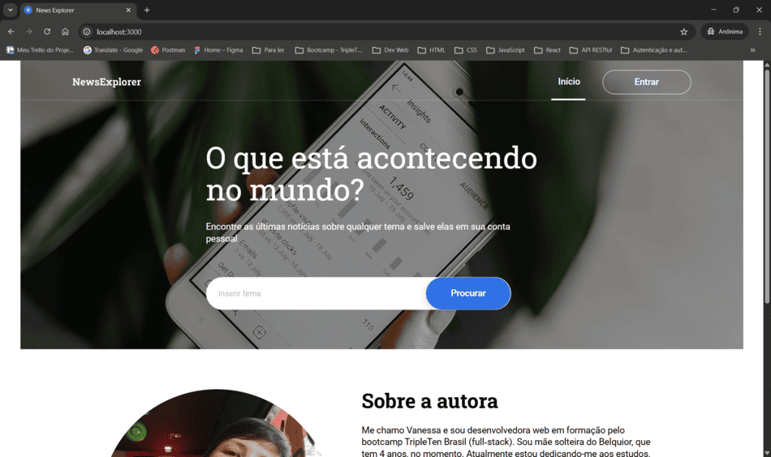
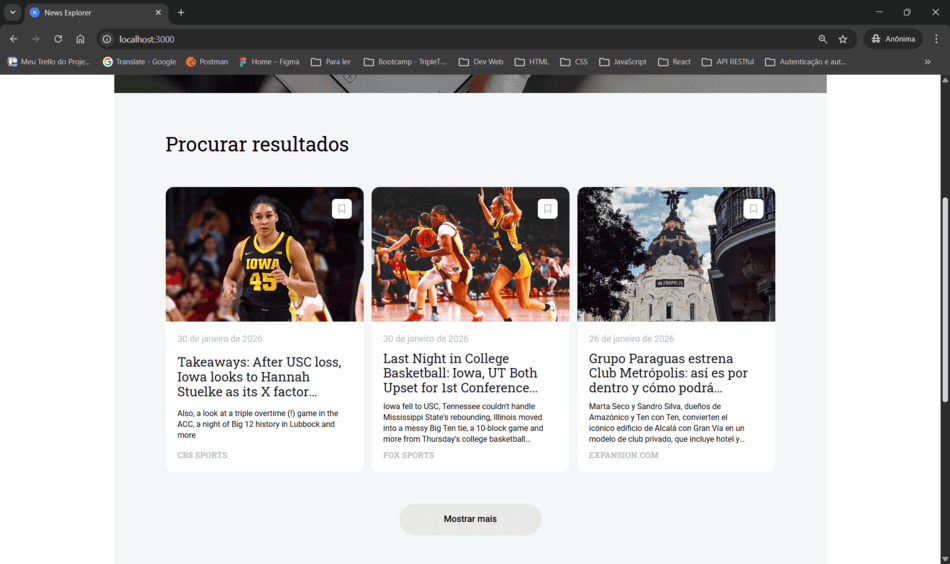
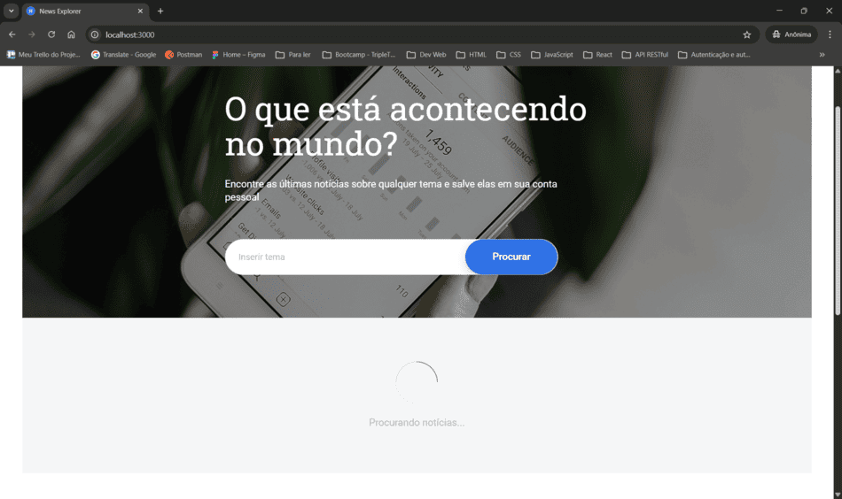
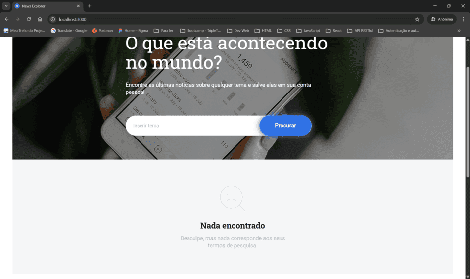
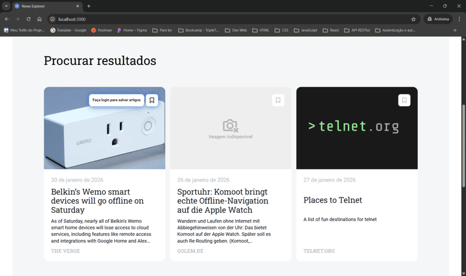

<a id="top"></a>

# 🅽 Projeto Final - Web Project News Explorer

<!-- ⚙️ Tecnologias principais -->

[](https://nodejs.org/pt)
[](https://developer.mozilla.org/docs/Web/JavaScript)

[](https://react.dev/)
[](https://vitejs.dev/)

<!-- 🧰 Ferramentas e qualidade de código -->

[](https://www.npmjs.com/package/eslint-config-airbnb)
[](https://prettier.io/)

[](https://editorconfig.org/)

[](https://typicode.github.io/husky/)
[](https://github.com/okonet/lint-staged)

<!-- 💾 Infraestrutura e controle de versão -->

[](https://git-scm.com/)
[](https://github.com/VanessaYuriAB/web_project_api_full)

<!-- 🌍 Compatibilidade -->

[]()

---

## 📑 Índice

1. [Descrição 📚](#-1-descrição)
2. [Funcionalidades 🚀](#-2-funcionalidades)
3. [Estrutura do Projeto 🗃️](#️-3-estrutura-do-projeto)
4. [Principais Tecnologias Utilizadas 🛠️](#️-4-principais-tecnologias-utilizadas)
5. [Design do Projeto 📐](#-5-design-do-projeto)
6. [Instalação, Configuração e Execução 📦](#-6-instalação,-configuração-e-execução)
7. [Funcionalidades Obrigatórias Implementadas 📄](#-7-funcionalidades-obrigatórias-implementadas)
8. [Status do Projeto 🚧](#-8-status-do-projeto)
9. [Capturas de Tela 📸](#-9-capturas-de-tela)
10. [Demonstração 🎥](#-10-demonstração)
11. [Melhorias 📈](#-11-melhorias)
12. [Autora 👩‍💻](#-12-autora)

---

<a id="-1-descrição"></a>

## 📚 1. Descrição

Este projeto é uma aplicação front-end desenvolvida como parte do projeto final do bootcamp da TripleTen.

É a **fase 1 — Marcação e JSX + API de terceiros**.

O objetivo do aplicativo é permitir que usuários pesquisem notícias recentes a partir de uma palavra‑chave e salvem artigos em seus perfis.

[Voltar ao topo 🔝](#top)

---

<a id="-2-funcionalidades"></a>

## 🚀 2. Funcionalidades

- Pesquisa de notícias usando a **News API**.
- Exibição dos resultados com:
  - `Preloader` enquanto a API responde
  - Mensagem de erro para falhas na requisição
  - Estado `Nada encontrado`
- Exibição inicial de 3 cartões + botão `“Mostrar mais”`
- Layout responsivo seguindo o design do **Figma**
- Página principal (`/`) com formulário de busca
- Página `/saved-news` com artigos salvos
- Navegação entre rotas usando `React Router`
- Componentes funcionais organizados por diretórios
- Uso de hooks (ex: `useState`, `useEffect`)
- Janelas modais com abertura e fechamento via clique, overlay e tecla ESC

[Voltar ao topo 🔝](#top)

---

<a id="-3-estrutura-do-projeto"></a>

## 🗃️ 3. Estrutura do Projeto

```
src/
├─ assets/
├─ components/
│ ├─ About/
│ ├─ App/
│ ├─ Footer/
│ ├─ Header/
│ │ ├─ componentes/
│ │   ├─ ForMobileHeaderAndNav/
│ │   └─ Navigation/
│ ├─ NewsCardList/
│ │ ├─ componentes/
│ │   └─ NewsCard/
│ ├─ NothingFound/
│ ├─ Popups/
│ │ ├─ componentes/
│ │   ├─ SearchTooltip/
│ │   ├─ Signin/
│ │   ├─ Signup/
│ │   └─ SignupTooltip/
│ ├─ Preloader/
│ ├─ ProtectedRoute/
│ ├─ SavedNewsCardList/
│ │ ├─ componentes/
│ │   └─ SavedNewsCard/
│ ├─ SavedNewsHeader/
│ │ ├─ componentes/
│ │   ├─ ForMobileSavedNewsHeaderAndNav/
│ │   └─ SavedNewsNavigation/
│ ├─ SearchMain/
│ │ ├─ componentes/
│ └   └─ SearchForm/
├─ contexts/
├─ hooks/
├─ utils/
│ ├─ NewsApi.js
│ └─ ...
├─ index.css
└─ main.jsx
```

[Voltar ao topo 🔝](#top)

---

<a id="-4-principais-tecnologias-utilizadas"></a>

## 🛠️ 4. Principais Tecnologias Utilizadas

- **React + Vite** ⚛️⚡
- **React Router** 🌐
- **JavaScript (ES6+)** 📜
- **CSS (BEM + Flexbox + Grid)** 🎨
- **News API** 📰
- **Normalize.css** ⚙️
- **Git e GitHub** 💾

[Voltar ao topo 🔝](#top)

---

<a id="-5-design-do-projeto"></a>

## 📐 5. Design do Projeto

Layout baseado no protótipo oficial: https://www.figma.com/design/7tUd4j0h1hgfWL39UNJhRt/Seu-Projeto-Final-PT

[Voltar ao topo 🔝](#top)

---

<a id="-6-instalação,-configuração-e-execução"></a>

## 📦 6. Instalação, Configuração e Execução

### 1️⃣ Clone o repositório

```bash
git clone git@github.com:VanessaYuriAB/new-explorer-frontend.git
cd new-explorer-frontend
```

### 2️⃣ Instale as dependências

```bash
npm install
```

### 3️⃣ Crie o arquivo .env.development na raiz do projeto com as variáveis da News Api:

- URL base da News Api:

  `VITE_BASE_NEWS_API_URL=https://api.exemplo.com`

- Chave de acesso da News Api:

  `VITE_NEWS_API_KEY=sua-chave-aqui`

### 4️⃣ Execute o projeto em modo de desenvolvimento

```bash
npm run dev
```

📌 **Observação**: a aplicação funcionará normalmente mesmo com o backend offline. As operações de salvar e remover artigos utilizarão o fallback com `localStorage` para persistência temporária dos dados quando o servidor não estiver disponível.

[Voltar ao topo 🔝](#top)

---

<a id="-7-funcionalidades-obrigatórias-implementadas"></a>

## 📄 7. Funcionalidades Obrigatórias Implementadas

✔️ Marcação portada para **JSX**

✔️ Componentização completa

✔️ Responsividade, sem rolagem horizontal

✔️ Rotas `/` e `/saved-news`

✔️ `Preloader` integrado ao fluxo da **API**

✔️ Conexão com API via `fetch`

✔️ Mensagens de erro e estados de interface

✔️ Layout seguindo o **Figma**

✔️ Estrutura recomendada (`utils`, `components`, etc.)

✔️ Modais funcionais (abrir/fechar/ESC)

✔️ `“Mostrar mais”` implementado

✔️ `Armazenamento local` com persistência de dados configurado

[Voltar ao topo 🔝](#top)

---

<a id="-8-status-do-projeto"></a>

## 🚧 8. Status do Projeto

Em desenvolvimento.

- **Fase 1 (atual): Marcação, JSX e integração com a API de terceiros.**
- Fase 2: Back-end
- Fase 3: Autorização com React
- Fase 4: Finalização do Projeto

[Voltar ao topo 🔝](#top)

---

<a id="-9-capturas-de-tela"></a>

## 📸 9. Capturas de Tela

- 1️⃣ Tela de Pesquisa (estado inicial)



_Campo de busca, header, layout limpo. "Porta de entrada" do app._

- 2️⃣ Tela com Cards Retornados da Pesquisa



_Cards organizados em 3 colunas, botão “Mostrar mais”, imagens, títulos e fontes. O funcionamento principal do projeto._

- 3️⃣ Tela de Cards Salvos


_Estado logado, ícones de lixeira, lista de artigos salvos, header especial de “Artigos Salvos”. O CRUD (parcial)._

- 4️⃣ Tela do Preloader em ação



_Atenção ao UX e uso correto de estado de carregamento._

- 5️⃣ Tela “Nada Encontrado”



_Tratamento de erro/estado vazio._

- 6️⃣ Tooltip do botão de salvar (versão deslogada)



_O hover com a mensagem “Faça login para salvar artigos”._

[Voltar ao topo 🔝](#top)

---

<a id="-10-demonstração"></a>

## 🎥 10. Demonstração

Vídeo demonstrativo no Loom: [clique aqui](https://www.loom.com/share/b7abb3ad2cc44866975bfcc2a84251f6)

[Voltar ao topo 🔝](#top)

---

<a id="-11-melhorias"></a>

## 📈 11. Melhorias

🧩 **Refatoração do Popups**: centralizar a lógica dos formulários em contexto, inclusive objetos para configuração de childrens. Reduzindo duplicação, melhorando a composição e flexibilizando os modais.

📐 **Ajuste no posicionamento do Header**: revisar o comportamento atual para evitar deslocamento artificial do conteúdo. A ideia é reposicionar apenas o Header e eliminar espaçamentos compensatórios (como `height: 100vh` usado apenas para empurrar elementos).

🛈 **Melhoria de acessibilidade no Tooltip**: os tooltips exibidos ao passar o mouse sobre o botão de salvar funciona via CSS. Substituir por um elemento real (como `<span>` ou `<div>`) com `role="tooltip"` para maior acessibilidade e compatibilidade com leitores de tela.

📦 **Unificação de componentes duplicados**: refatorar componentes que possuem lógica ou estrutura muito semelhante, consolidando-os em versões reutilizáveis posicionadas um nível acima na arquitetura. Reduz redundância, facilita manutenção e deixa o código mais limpo.

[Voltar ao topo 🔝](#top)

---

<a id="-12-autora"></a>

## 👩‍💻 12. Autora

Desenvolvido com React, dedicação e muitos estudos por Vanessa Yuri A. Brito, explorando o universo do front‑end um componente por vez.

[Voltar ao topo 🔝](#top)
